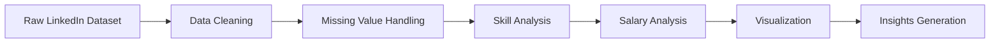

# 💼 LinkedIn Job Posting Analysis


A data analytics project focused on analyzing LinkedIn job postings to uncover hiring trends, required skills, salary patterns, and role distributions using Python and data visualization.

---

## Project Overview

This project explores real-world LinkedIn job posting data to understand current hiring trends and industry demands.

Key objectives:

- Analyze hiring patterns across roles
- Identify top in-demand skills
- Explore salary distributions
- Study experience-level requirements
- Visualize recruitment trends

---

## Tech Stack

- Python
- Pandas
- NumPy
- Matplotlib
- Seaborn
- Jupyter Notebook

---

## Project Structure

```md
LinkedIn-Job-Posting-Analysis/
│
├── data/
│ ├── linkedin_jobs.csv
│ └── cleaned_jobs_data.csv
│
├── notebook/
│ └── linkedin_analysis.ipynb
│
└── README.md
```

---

## Analysis Workflow



---

## Key Analysis Performed

- Job role distribution analysis
- Skills demand analysis
- Salary trend visualization
- Experience-level comparison
- Company hiring insights
- Remote vs onsite opportunities

---

## Output

Generated insights and visualizations useful for:
- Job market understanding
- Career trend analysis
- Skill demand exploration
- Analytics dashboards

---

## Future Improvements

- Interactive Power BI dashboard
- NLP on job descriptions
- Skill recommendation system
- Hiring trend forecasting

---

## Report

This project is created only for educational and analytical purposes.  
Plagiarism is strictly prohibited.

---

⭐ If you found this project helpful, consider giving it a star!
